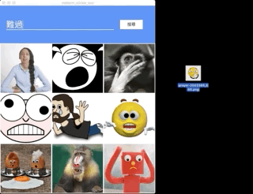

# StickerBox 2.0

A cross-platform desktop app featuring search, pick, save, share, and manage stickers while chatting with others. In this version, StickerBox is capable of managing user's accounts ,user's own tags, and user's own stickers all together.

## Overview

StickerBox 2.0 is an all-in-one solution for users to deal with sticker images while chatting with others on desktop apps such as Line, Slack, Messenger, ...etc. The application supports MacOS and Windows.
With StickerBox 2.0, users can

* browse and search for stickers
* search and subscribe a tag
* manage their own stickers, own tags, and subscribed tags.

To use StickerBox 2.0, one must register and login first.
After login, the first page is for searching stickers and tags. User can

* search stickers by entering a simple searchterm in the search bar
* search tags by entering a searchterm starting with a hash tag, "#".

There is a button located at the bottom right corner, which can switch the page from search page to own page or the opposite.
In the own page, user can

* change the description of each sticker he owns
* modify the information of each tag he owns
* manage the tags that he subscribed
* delete his own stickers or own tags

To send a sticker, just drag it from StickerBox to desktop chatting apps. Besides, StickerBox 2.0 keeps and makes the drag-and-upload feature even better. It allows users to upload local images to server, add some description for it, and share it with others by tag. In summary, StickerBox 2.0 covers all needs regarding to stickers in a desktop-chat settings.

* Note: due to the backend monolingual word-embedding settings, StickerBox only supports **Chinese** so far.
* Note: when entering a searchterm, only those stickers which belong to tags that **the user had subscribed** will show up, which means, **one must subscribe a tag before searching for stickers belong to it.** A tag can be subscribed after being searched in the searchbar.
* Disclaimer: this app provides features of uploading images in public domain. However, before you download and use it, please be noticed that you have to be leagally responsible for any kind of misusage regarding to copyrights. Please do not upload any images without permission of their own creator! (The default images of this project were from [Pixabay](https://pixabay.com/) -- A vibrant community of creatives, sharing copyright free images and videos)

## How to use

* Download the latest distributable of your platform from the [release](https://github.com/tom6311tom6311/midterm_sticker_box/releases) page

* On downloaded, unzip the file and you can run the resulting executable

* To register

* To login

* To search and browse stickers:

* To send stickers:

* To upload stickers:

* To search and subscribe tags:

* To modify description of own stickers:

* To delete own stickers:

* To subscribe tags of own stickers:

* To create own tags:

* To manage subscribed tags

* To kick subscribers from subscribing own tags

## Known issues

1. This app doesn't support drag stickers to Slack and Messenger directly so far, since they only accept local files to be dropped in. As a workaround, please drag the sticker to desktop, then drag it from desktop to Slack / Messenger.

## Framework used

* [React](https://reactjs.org/) - The web framework used
* [Node](https://nodejs.org/) - The backend runtime environment
* [Electron](https://electronjs.org/) - The framework used to build cross-platform Apps
* [Express](https://expressjs.com) - A minimal and flexible Node.js web application framework that provides a robust set of features for web and mobile applications.
* [Graphql](https://graphql.org) - A query language for APIs and a runtime for fulfilling those queries with  existing data.

## How to build

1. Please find a server machine and follow [this](https://github.com/tom6311tom6311/sticker_box_server/blob/master/README.md) README to deploy the server
2. Exit the server and turn back to your local computer
3. Make sure you have Node (`^10.15.3`) and NPM (`^6.9.0`) installed
4. Clone [this](https://github.com/tom6311tom6311/midterm_sticker_box) project to your computer
5. `cd midterm_sticker_box`
6. `npm i`
7. In `src/const/AppConfig.const.js`, set `SERVER_URL` to `http://<your server's IP or domain>:5000`.
8. `npm start` to show in debugging mode
9. `npm run make` to generate executable for your platform

## Credits

* [Electron Forge](https://electronforge.io) for the Electron + React boilerplate
* [Kyubyong](https://github.com/Kyubyong/wordvectors) for the pre-trained word vectors
* [Pixaby](https://pixabay.com) for the high-quality copyright-free images
* [jieba](https://www.npmjs.com/package/nodejieba) for accurate Chinese text segmentation
* [MATERIAL-UI](https://material-ui.com) for React components that implement Google's Material Design
* [Egor](https://medium.com/@650egor/simple-drag-and-drop-file-upload-in-react-2cb409d88929) for the React file drop zone tutorial
* [Apollo](https://www.apollographql.com) for providing a way to bridge front-end to a graphql server
* [Graphql-yoga](https://github.com/prisma/graphql-yoga) for setting graphql server and providing a great developing environment
* [ian13456](https://github.com/ian13456/modern-graphql-tutorial) for providing a useful graphql tutorial example

## Contribution

這次期末專題我們這組的組員有我和我弟，和過去其他報告不同的點在於因為組員是我弟，我們的合作方式幾乎都是每天找個共同時間待在一起，開VScode Live Session 共同編輯，實作的功能、遇到的問題都能當面立即討論，也因此投入的時間和精力幾乎可以說是一人一半，分工項目則很難區分清楚（由於我對Web方面較有經驗，就產出來說或許會佔稍多一點）。不過也因為這樣可以花很多時間一起討論，溝通上比較沒有誤解，整體而言，這是一次很有效率且很順利的分工。

## Thoughts

Graphql 對我們來說是一個全新的概念，這樣的架構是過去寫網頁都沒用過的，我們從上課範例中看到graphql架構脈絡清晰簡單扼要的優點，因此希望將期中專題的作品用graphql重新建立，並且加入更多功能作為期末專題。在製作期末專題的過程中，一開始常常因為對graphql基礎架構不清楚而產生很多bug，後來觀念清楚後工作效率大為提升，也真正體會到graphql相較於restful的方便之處。唯一的小小遺憾是我們太晚開始做這項專題（大概花了三個禮拜），等到把graphql的每一種type都摸熟時間已經所剩無幾，也因此沒辦法把code修到最好，不過這項成果我們希望真的能自己拿來使用，因此後續還會持續更新版本，讓功能更加完整。如果大家有興趣想要使用也歡迎隨時追蹤我們的release!